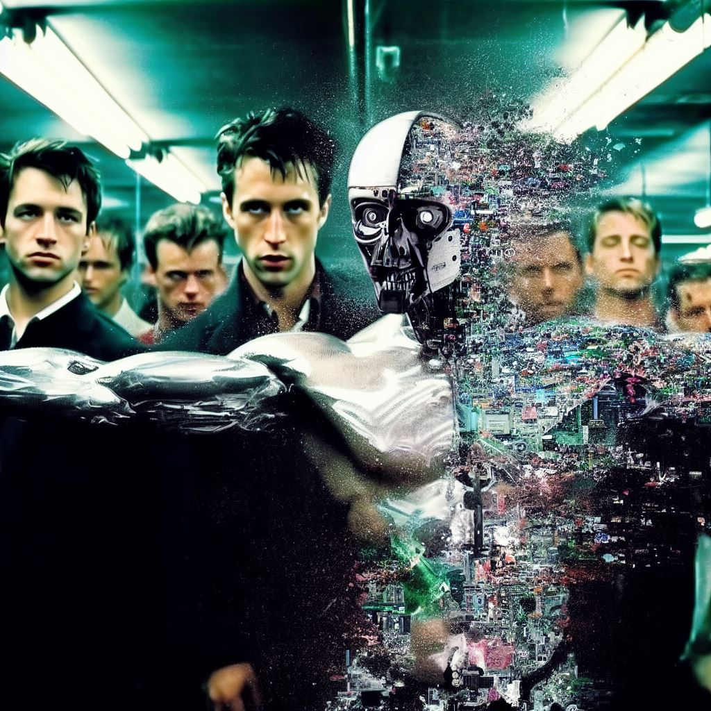

# ML-Club

Únete a nuestro club y desbloquea los secretos del Machine Learning.

---

# Reglas del Machine Learning Club

* Nadie expone algo que no entiende en el club del Machine Learning.
* Si alguno de los participantes grita "ya basta freezer!!!", la exposición termina inmediatamente si todos están de acuerdo.
* Solo un tema cada vez por persona.
* Se puede exponer sin camisa ni zapatos.
* Las exposiciones duran máximo 20 minutos.
* Si es la segunda vez de un integrante en el club, tiene que exponer.
* Tu exposición tiene que ser un archivo .ipynb (jupyter notebook, jupyter lab o google colab).
* Después de tu exposición tendrás que hacer un pull request de tu exposición a este repositorio [ML-Club](https://github.com/lilberick/ML-Club), así estará disponible para todos.

# Temas Pendientes (basado en el libro: [Mathematics for machine learning](https://mml-book.github.io/book/mml-book.pdf))

|usuario|Part I: Mathematical Foundations|
|---|---|
|mochi|3 (Analytic Geometry)|
|fer|4 (Matrix Decompositions)|
|juan solo|7 (Continuous Optimization)|
|sebdev|6 (Probability and Distributions)|
|lilberick|5 (Vector Calculus)|
|libre|2 (Linear Algebra)(Si no tienes tema, tómalo)|

# Próxima reunión: Domingo 29/10/23

|País|Hora|
|---|---|
|Argentina|13:00 - 15:00|
|España|18:00 - 20:00|
|Colombia|11:00 - 13:00|
|El Salvador|10:00 - 12:00|
|Panamá|11:00 - 13:00|
|Perú|11:00 - 13:00|
|Venezuela|12:00 - 14:00|
|México|10:00 - 12:00|
